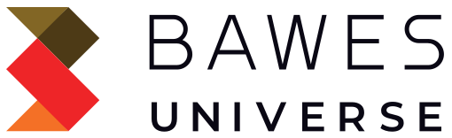
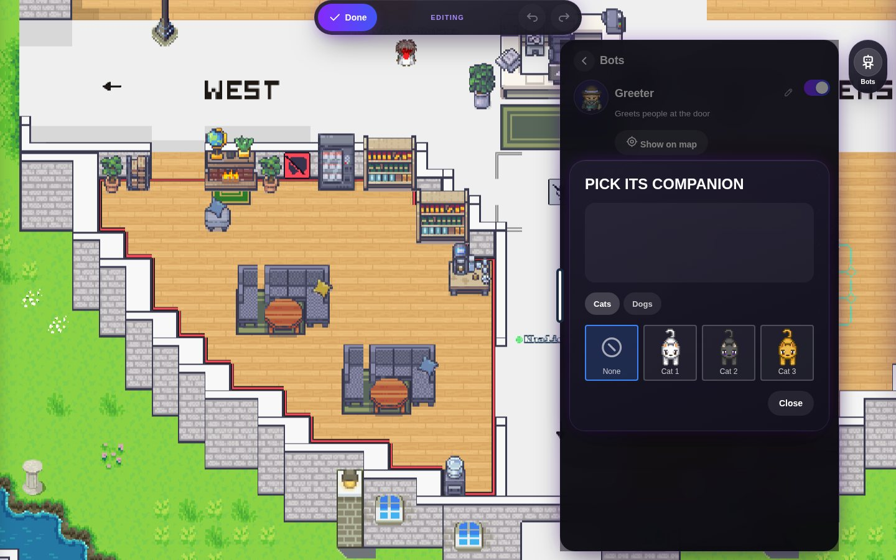

<p align="center">
  <picture>
    <source media="(prefers-color-scheme: dark)" srcset="docs/images/bawes-universe-logo-dark.svg">
    
  </picture>
</p>

<p align="center">
  <a href="https://universe.bawes.net"></a>
</p>

<p align="center">
  <a href="https://github.com/BAWES-Universe/workadventure-universe/actions/workflows/continuous_integration.yml"></a>
  <a href="https://github.com/BAWES-Universe/workadventure-universe/releases"></a>
  <a href="https://discord.gg/CXceJWnwNT"></a>
  <a href="https://bawes.net"></a>
  <a href="https://github.com/workadventure/workadventure"></a>
</p>

# BAWES Universe

A shared online world where people explore, AI agents live alongside them, and communities build together.

Walk up to someone and you are in a video call. Build your rooms right on the map. Put AI bots in them that greet, remember and help. Run all of it from Orbit, our admin app.

<p align="center">
  <a href="https://universe.bawes.net"></a>
  <a href="https://bawes.net"></a>
  <a href="https://discord.gg/CXceJWnwNT"></a>
</p>



## What you can do

**Meet and talk**
- Walk up to someone and a video call starts. Walk away and it ends. ([Proximity chat](https://bawes.net/features/proximity-chat))
- [Meeting rooms](https://bawes.net/features/meeting-rooms), [screen sharing](https://bawes.net/features/screen-sharing) and [follow](https://bawes.net/features/follow).
- [Broadcast](https://bawes.net/features/broadcasting) to a whole room or world: a message, a voice note, or go live.
- [Chat and DMs](https://bawes.net/features/text-chat) with [reactions](https://bawes.net/features/emoji-reactions), replies and files.

**AI bots**
- Bots that live on the map. They walk, [greet people](https://bawes.net/features/bot-greetings), [remember](https://bawes.net/features/bot-memory) and [answer as they type](https://bawes.net/features/bot-streaming).
- They can [use tools](https://bawes.net/features/bot-tools), [read files](https://bawes.net/features/bot-file-parsing) and [send pictures](https://bawes.net/features/bot-media-sending).
- Connect them to [MCP servers](https://bawes.net/mcp-integration). Make them in the [bot editor](https://bawes.net/features/bot-editor).

**Build your space**
- [Edit your room on the map](https://bawes.net/features/map-editor): objects, [areas](https://bawes.net/features/area-zones), bots, with undo and redo.
- Start from a [map template](https://bawes.net/features/map-templates) or bring your own [Tiled map](https://bawes.net/features/maps).
- [Woka avatars](https://bawes.net/features/woka-avatars) and the [scripting API](https://bawes.net/features/scripting).

**Run it with Orbit**
- [Orbit](https://bawes.net/features/orbit-operator) is where you manage universes, worlds, rooms, members and bots. It lives in [workadventure-universe-admin](https://github.com/BAWES-Universe/workadventure-universe-admin).

**Host it yourself**
- [Docker Compose or Helm](https://bawes.net/features/self-hosting), sign in with any [OIDC provider](https://bawes.net/features/oidc-auth), and an [admin API](https://bawes.net/features/admin-api).

**[See every feature on bawes.net →](https://bawes.net/features-overview)**

## What's new in v0.3

- **A new look.** The game and Orbit now share one dark Universe style.
- **Edit your room on the map.** Objects, areas and bots, on a computer or a phone. ([Map editor](https://bawes.net/features/map-editor))
- **Look around the map.** See the whole room and its places, then walk there.
- **Broadcast.** Send a message or a voice note to a room or a world, or go live. ([Broadcasting](https://bawes.net/features/broadcasting))
- **Raise your hand** in a call.
- **Chat.** Reactions and replies nearby, and drop files into chat or onto the map.
- **Bots** keep to their own area and come over to people.
- **Orbit.** See who is live, answer invitations, your passport, and recent visitors to the places you manage.
- **Safer.** Only the right people can kick, edit maps or change bots, and emails stay private.

Full list: [v0.3.0 release notes](https://github.com/BAWES-Universe/workadventure-universe/releases).

## How Universe fits together

| Part | Where | What it does |
|---|---|---|
| Game | this repo: `play`, `back`, `map-storage`, `uploader` | The world you walk around in |
| Bot server | this repo: `bots` | Runs the AI bots |
| Discord bot | this repo: `discord-bot` | Posts room joins and activity to Discord |
| Orbit | [workadventure-universe-admin](https://github.com/BAWES-Universe/workadventure-universe-admin) | Admin app and admin API |
| Chat | Matrix Synapse (`synapse`) | Chat rooms and DMs |
| Calls | LiveKit | Calls with many people |

Work lands on `universe-develop` and is tested on our dev server. `universe` is what runs live at [universe.bawes.net](https://universe.bawes.net).

## Setting up a production environment

We support 2 ways to set up a production environment:

- using Docker Compose
- or using a Helm chart for Kubernetes

Please check the [Setting up a production environment](docs/others/self-hosting/install.md) guide for more information.

## Setting up a development environment

> [!NOTE]
> These installation instructions are for local development only. They will not work on
> remote servers as local environments do not have HTTPS certificates.

Install Docker and clone this repository.

> [!WARNING]
> If you are using Windows, make sure the End-Of-Line character is not modified by the cloning process by setting
> the `core.autocrlf` setting to false: `git config --global core.autocrlf false`

Run:

```
cp .env.template .env
docker-compose up
```

The environment will start with the OIDC mock server enabled by default.

You should now be able to browse to http://play.workadventure.localhost/ and see the application.
You can view the Traefik dashboard at http://traefik.workadventure.localhost

(Test user is "User1" and password is "pwd")

If you want to disable the OIDC mock server (for anonymous access), you can run:

```console
$ docker-compose -f docker-compose.yaml -f docker-compose-no-oidc.yaml up
```

Note: on some OSes, you will need to add this line to your `/etc/hosts` file:

**/etc/hosts**
```
127.0.0.1 oidc.workadventure.localhost redis.workadventure.localhost play.workadventure.localhost traefik.workadventure.localhost matrix.workadventure.localhost extra.workadventure.localhost icon.workadventure.localhost map-storage.workadventure.localhost uploader.workadventure.localhost maps.workadventure.localhost api.workadventure.localhost front.workadventure.localhost
```

### Troubleshooting

See our [troubleshooting guide](docs/others/troubleshooting.md).

## Building maps

1. Want to build your own map, check out the **[map building documentation](https://docs.workadventu.re/map-building/)**
2. Check out resources developed by the WorkAdventure community at **[awesome-workadventure](https://github.com/workadventure/awesome-workadventure)**

## Built on WorkAdventure

Universe started as a fork of [WorkAdventure](https://github.com/workadventure/workadventure) by TheCodingMachine. The game engine, the map format and the scripting API come from them, and their documentation still applies. Thank you to the WorkAdventure team and community.

WorkAdventure also offers a [hosted version](https://workadventu.re/?utm_source=github) of their own platform.

## Community

- **Universe questions and ideas:** [our Discord](https://discord.gg/CXceJWnwNT)
- **Website:** [bawes.net](https://bawes.net)
- **WorkAdventure itself:** [their Discord](https://discord.gg/G6Xh9ZM9aR)
